# Frontend User Journey Map

Source scan: SvelteKit routes in `src/routes`, shared navigation in `src/lib/components/Sidebar.svelte`, `TopBar.svelte`, and marketing header/footer components.

Legend:

```text
[PAGE]        user can see this screen
{DECISION}    page redirects depending on state
(ACTION)      click, form submit, upload, or button
-->           navigation / redirect
--x           route is referenced but not built in this frontend tree
```

## 1. Whole Site Map

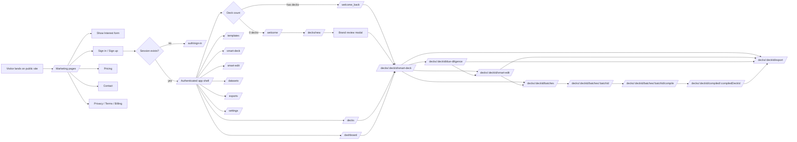

## 2. Global Navigation

### Public marketing shell

User sees this on `/`, `/pricing`, `/vcs`, `/about`, `/contact`, `/billing`, `/privacy`, `/terms`.

```mermaid
flowchart TD
  PublicHeader[Marketing header] --> Home[/ Product: /]
  PublicHeader --> VCs[/ For VCs: /vcs/]
  PublicHeader --> Pricing[/ Pricing: /pricing/]
  PublicHeader --> About[/ About: /about/]
  PublicHeader --> Contact[/ Contact: /contact/]
  PublicHeader --> SignIn[/ Sign in: /auth/sign-in/]
  PublicHeader --> Interest[/ Show interest: /#show-interest/]

  PublicFooter[Marketing footer] --> FooterPricing[/pricing/]
  PublicFooter --> FooterBilling[/billing/]
  PublicFooter --> FooterVCs[/vcs/]
  PublicFooter --> FooterAbout[/about/]
  PublicFooter --> FooterContact[/contact/]
  PublicFooter --> FooterPrivacy[/privacy/]
  PublicFooter --> FooterTerms[/terms/]
  PublicFooter --> FooterSignIn[/auth/sign-in/]
  PublicFooter --> FooterSignUp[/auth/sign-up/]
```

Built in:

- Header: `src/lib/components/marketing/MarketingHeader.svelte`
- Footer: `src/lib/components/marketing/MarketingFooter.svelte`
- Utility bar: `src/lib/components/marketing/MarketingUtilitiesBar.svelte`
- Shell is hidden on `/auth/*` and `/sign_in_landing`.

### Authenticated app shell

Every `(app)` page is guarded. If there is no session, the user is redirected to `/auth/sign-in?next=<current-page>`.

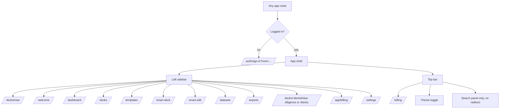

Built in:

- Auth guard: `src/routes/(app)/+layout.server.ts`
- App shell: `src/lib/components/AppShell.svelte`
- Sidebar: `src/lib/components/Sidebar.svelte`
- Top bar: `src/lib/components/TopBar.svelte`

## 3. Public Journey Pages

### `/` Home

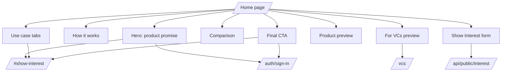

User sees:

| Moment | Options available |
| --- | --- |
| Product landing | `Talk to Deck AIStack` -> `/#show-interest`; `Sign in` -> `/auth/sign-in` |
| Use case strip | switch tabs in-place; `Talk to Deck AIStack` -> `/#show-interest` |
| Show Interest form | submit lead to `/api/public/interest`; stays on page with success/error |
| Footer/header | pricing, billing, VC page, about, contact, privacy, terms, auth |

### `/pricing`

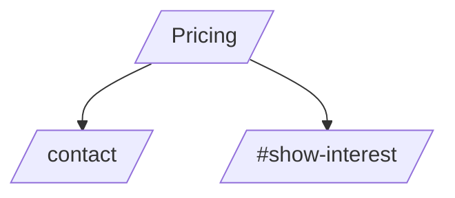

User sees premium transformation pricing. Main redirects:

- `Contact us` -> `/contact`
- `Book a consultation` / `Discuss your deck` -> `/#show-interest`

### `/vcs`, `/about`, `/contact`, `/billing`, `/privacy`, `/terms`

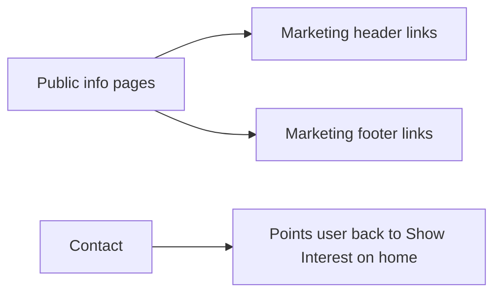

These pages mainly use shared header/footer redirects. `/contact` tells the user the fastest path is the home page Show Interest form.

## 4. Auth Journey

### `/auth/sign-in`

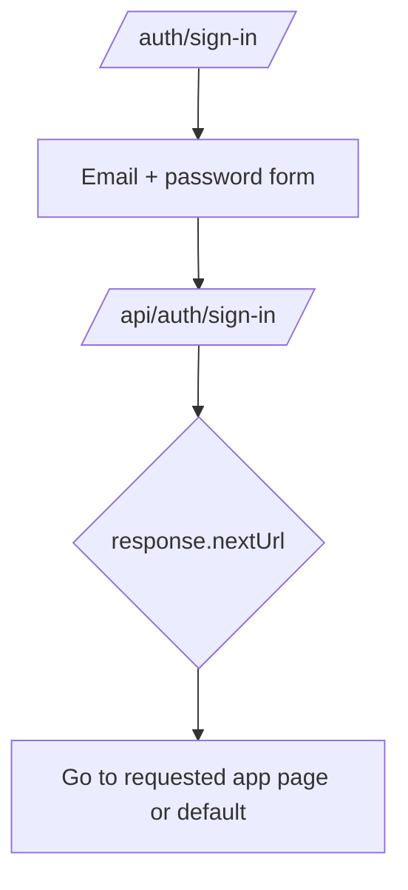

User sees:

- Email field
- Password field
- Submit button
- Alternate link is provided by the public auth shell if configured

### `/auth/sign-up`

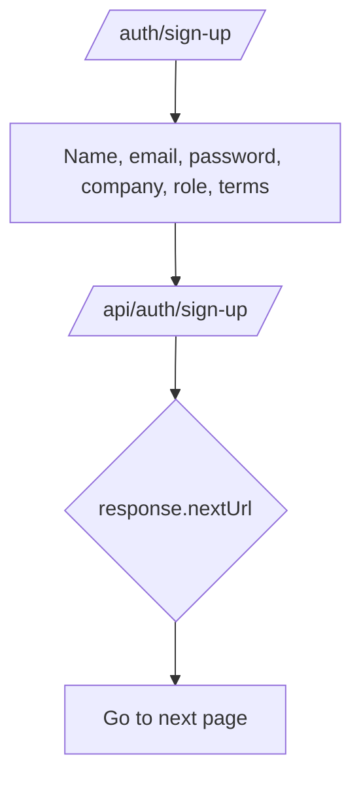

### `/auth/callback` and `/auth/success`

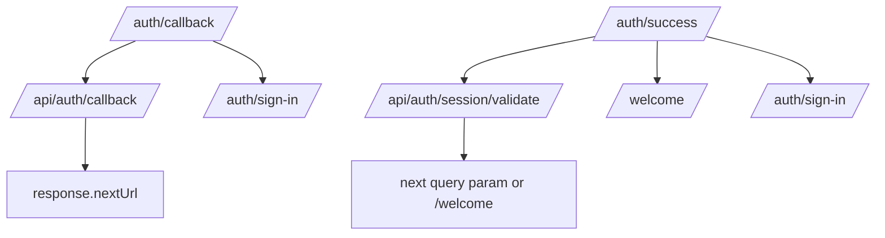

### Legacy auth aliases

| Route user enters | Redirect |
| --- | --- |
| `/sign-in` | `/auth/sign-in` |
| `/sign-up` | `/auth/sign-up` |

## 5. First-Time App Journey

### `/welcome`

State rule:

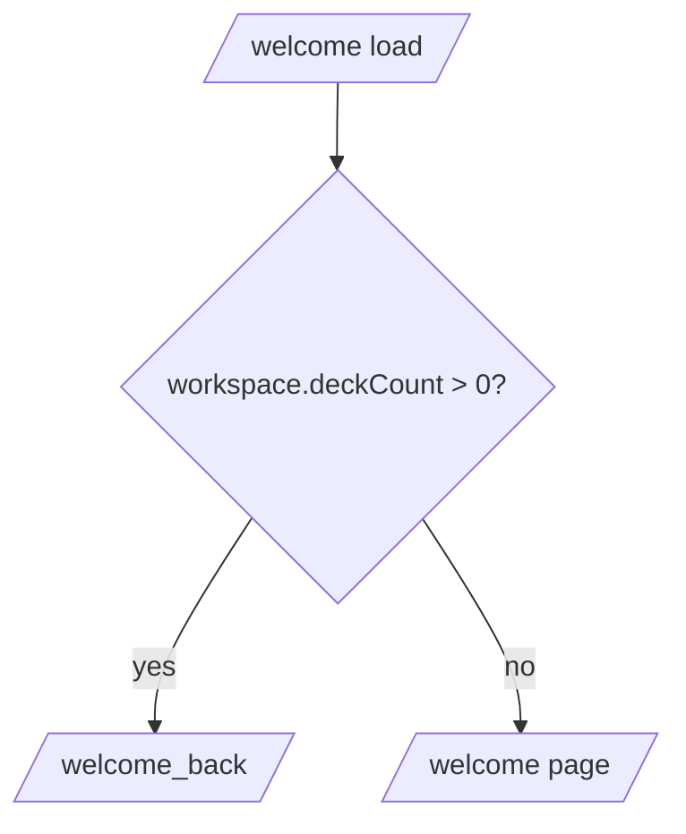

User sees:

| Moment | Options available |
| --- | --- |
| Welcome hero | `Design your first deck` -> `/decks/new` |
| Setup tiles | Microsoft setup, LinkedIn setup, brand defaults |
| Action cards | `Upload a deck` -> `/decks/new`; `Guided deck intake`; `Load your API key` |

Important route gap:

```text
/settings/account/connected-accounts?provider=microsoft...  exists
/settings/account/connected-accounts?provider=linkedin...   exists
/settings/brand-defaults                                    referenced, not found
/decks/new?mode=guided                                      page exists as query state on /decks/new
```

### First-time dashboard empty state

When `/dashboard` has `uploadedDecks === 0`, user sees `FirstTimeDashboard`.

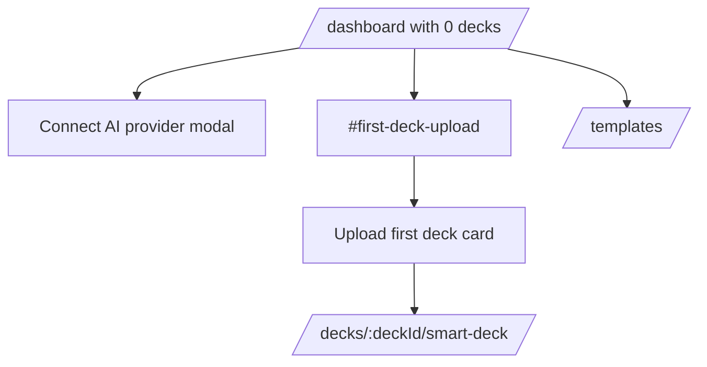

## 6. Upload and Brand Journey

### `/decks/new`

This is the most important conversion path inside the app.

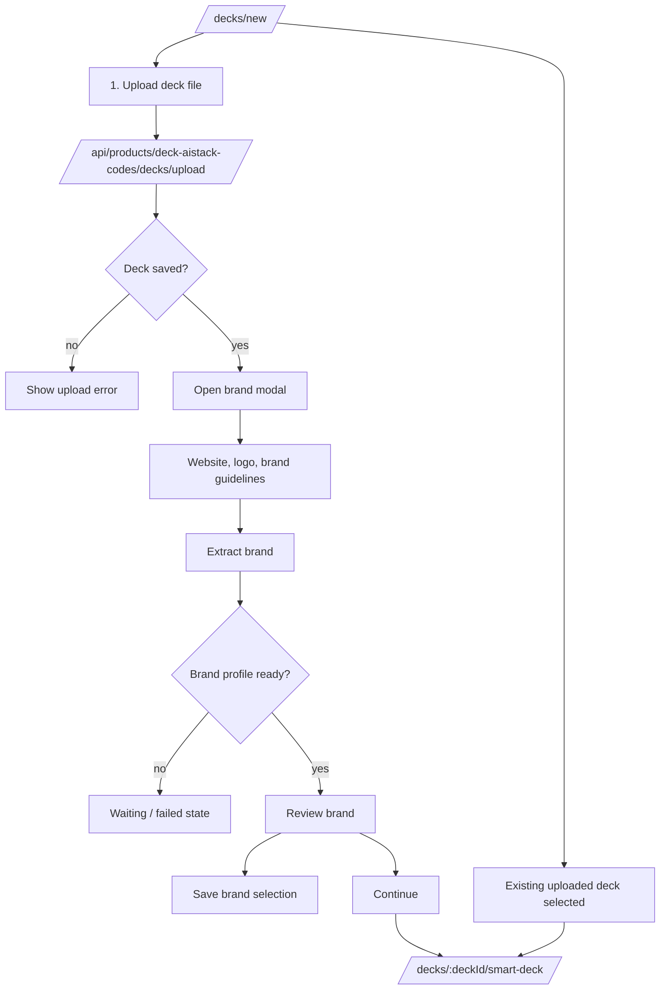

User sees:

| Step | Visible options | Redirect |
| --- | --- | --- |
| Upload deck | choose `.pdf`, `.ppt`, `.pptx`; upload progress; error/success banner | none until saved |
| Load brand | company website input, logo upload, brand guidelines upload | none |
| Extract brand | `Extract brand` button | none |
| Review brand modal | edit/approve/save brand; continue | `/decks/:deckId/smart-deck` |
| Existing deck list | select a previously uploaded deck | `/decks/:deckId/smart-deck` |

## 7. Dashboard and Library

### `/dashboard`

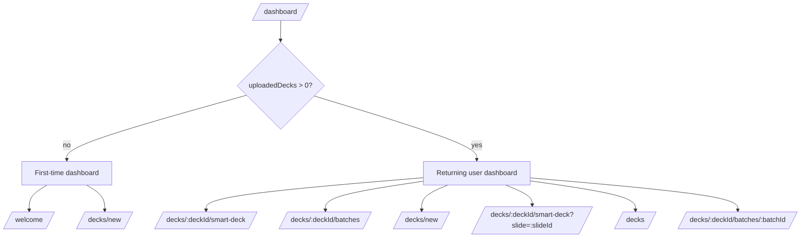

Top action:

- If no decks: `Upload first deck` -> `/welcome`
- If decks exist: `New deck` -> `/decks/new`

### `/decks`

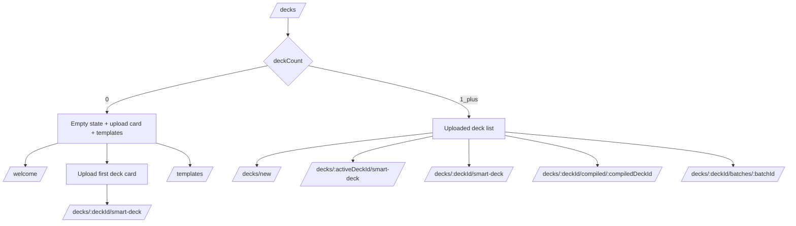

User sees:

- Library metrics
- Upload new deck
- Open active deck
- Uploaded deck rows
- Recent deck rail
- Status filter buttons: All decks, Under review, Ready, Failed. These are visible buttons; no redirect found.

## 8. Deck Workspace Journey

### Deck route index redirect

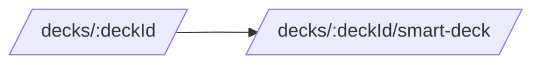

### `/decks/:deckId/smart-deck`

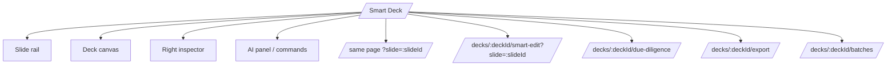

User sees:

| Moment | Options available |
| --- | --- |
| Top actions | Smart Edit, Due Diligence, Export |
| Slide rail / canvas | choose slide -> same route with `?slide=` |
| AI workspace actions | create version -> `/decks/:deckId/batches` after run |
| Sidebar deck workflow | Smart Deck, Smart Edit, Due Diligence, Iterations, Exports |

### `/smart-deck`

Root chooser when the user is not already inside a deck.

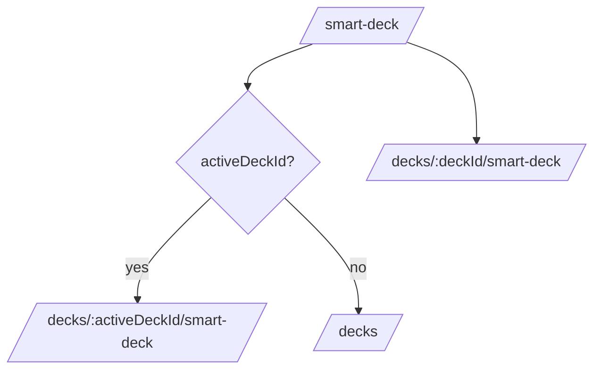

## 9. Smart Edit Journey

### `/smart-edit`

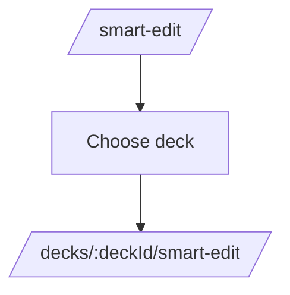

### `/decks/:deckId/smart-edit`

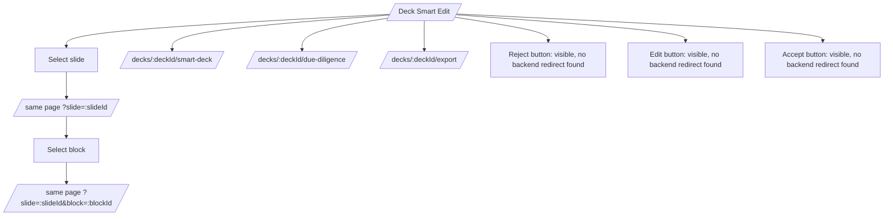

User sees:

- Slide count and slide list
- Main selected slide preview
- Block list
- Smart edit panel
- Prompt box and suggestion actions
- Breadcrumbs: `/decks` -> `/decks/:deckId/smart-deck`

## 10. Due Diligence Journey

### `/decks/:deckId/due-diligence`

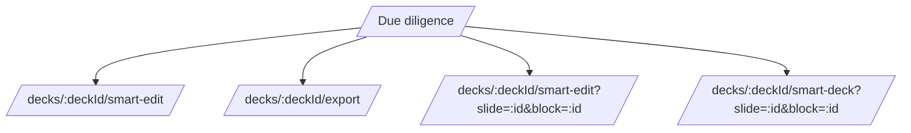

User sees:

- Diligence page header
- Placeholder card area
- Header actions to Smart Edit and Export
- Internal event handlers can jump to Smart Edit or Smart Deck with selected slide/block query params

Legacy redirects into this page:

| Old route | Redirect |
| --- | --- |
| `/decks/:deckId/changes` | `/decks/:deckId/due-diligence` |
| `/decks/:deckId/audience` | `/decks/:deckId/due-diligence` |
| `/decks/:deckId/diligence` | `/decks/:deckId/due-diligence` |

## 11. Iterations, Batch Review, Compile, Final Deck

### `/decks/:deckId/batches`

```mermaid
flowchart TD
  Batches[/Batch history/] --> Latest{latest batch exists?}
  Latest -- yes --> CompileLatest[/decks/:deckId/batches/:batchId/compile/]
  Latest -- no --> Disabled[Prepare Full Deck disabled]
  Batches --> BatchCard[/decks/:deckId/batches/:batchId/]
```

User sees:

- Complete adaptation history
- Latest batch CTA: Prepare Full Deck
- Batch cards for each iteration

### `/decks/:deckId/batches/:batchId`

```mermaid
flowchart TD
  BatchDetail[/Iteration detail/] --> CandidateDecision[Choose generated candidate or keep original]
  CandidateDecision --> Stay[Stay on batch detail]
  BatchDetail --> Prepare[Prepare Full Deck]
  Prepare --> Compile[/decks/:deckId/batches/:batchId/compile/]
```

User sees:

- Iteration name, scope, status
- Candidate actions:
  - choose generated version
  - keep original
- Prepare Full Deck button, disabled unless batch is completed/reviewed

### `/decks/:deckId/batches/:batchId/compile`

```mermaid
flowchart TD
  Compile[/Prepare full deck/] --> ReviewIteration[/decks/:deckId/batches/:batchId/]
  Compile --> DeckLibrary[/decks/]
  Compile --> CompileAction[Compile full deck]
  CompileAction --> CompiledReady{compiledDeck exists?}
  CompiledReady -- yes --> OpenCompiled[/decks/:deckId/compiled/:compiledDeckId/]
```

User sees:

- Batch decisions
- Ready to compile / compiled deck ready card
- `Compile full deck`
- `Open compiled deck` after compile

### `/decks/:deckId/compiled/:compiledDeckId`

```mermaid
flowchart TD
  Compiled[/Compiled deck/] --> Export[/decks/:deckId/export/]
  Compiled --> ReviewBatch[/decks/:deckId/batches/:batchId/]
  Compiled --> DeckLibrary[/decks/]
```

User sees rendered final deck slides and actions:

- Export deck
- Review batch
- Deck library

## 12. Export Pages

### `/decks/:deckId/export`

```mermaid
flowchart TD
  DeckExport[/Deck export/] --> ExportPanel[Export panel]
  ExportPanel --> DownloadExisting[Download existing export]
  ExportPanel --> DownloadAPI[/api/decks/:deckId/exports/:exportId/download/]
```

### `/exports`

```mermaid
flowchart TD
  ExportsRoot[/Exports root/] --> EmptyOrList[No exports yet / exports tied to deck workflows]
  ExportsRoot --> SidebarDeckExport[/decks/:deckId/export from sidebar if current deck exists/]
```

## 13. Utility App Pages

```mermaid
flowchart TD
  Templates[/templates/] --> Sidebar[Sidebar/global nav]
  Datasets[/datasets/] --> Sidebar
  Insights[/insights/] --> Sidebar
  Team[/team/] --> Sidebar
  AppBilling[/app/billing/] --> PlanButtons[Plan buttons visible, no redirect found]
```

Page notes:

| Page | What user sees | Redirect options |
| --- | --- | --- |
| `/templates` | template placeholder / starting points | sidebar/header only |
| `/datasets` | datasets placeholder after parsing | sidebar/header only |
| `/insights` | insights placeholder after AI analysis | sidebar/header only |
| `/team` | optional team access placeholder | sidebar/header only |
| `/app/billing` | plan selection and current plan | plan buttons are visible, no route change found |

## 14. Settings Journey

### `/settings`

```mermaid
flowchart TD
  Settings[/settings/] --> AccountSettings[/settings/account/settings/]
  Settings --> ConnectedAccounts[/settings/account/connected-accounts/]
  Settings --> PreviewRoutes[Preview debugging direct route pills]
```

### `/settings/account/settings`

```mermaid
flowchart TD
  AccountSettings[/Profile and preferences/] --> SaveChanges[Save changes button, no redirect]
  AccountSettings --> ConnectedAccounts[/settings/account/connected-accounts/]
  AccountSettings --> LinkedIn[Connect LinkedIn popup/action]
  AccountSettings --> Microsoft[Connect Microsoft popup/action]
  AccountSettings --> MaybeLater[Close reminder]
```

### `/settings/account/connected-accounts`

```mermaid
flowchart TD
  ConnectedAccounts[/Connected accounts/] --> ProviderButtons[Connect/disconnect provider buttons]
  ConnectedAccounts --> SamePage[State changes on same page]
```

Typo alias:

| Route user enters | Redirect |
| --- | --- |
| `/settings/account/conected-accounts` | `/settings/account/connected-accounts` |

## 15. Error Pages

```mermaid
flowchart TD
  NotFound[/error/404/] --> Dashboard[/dashboard/]
  NotFound --> Intake[/sign_in_landing/]
  RouteList[/error/200/] --> ListedRoute[Click listed route]
```

## 16. Redirect-Only and Guarded Routes

| Route | What happens |
| --- | --- |
| Any `(app)` route while logged out | `/auth/sign-in?next=<current>` |
| `/welcome` with existing decks | `/welcome_back` |
| `/welcome_back` with no decks | `/welcome` |
| `/decks/:deckId` | `/decks/:deckId/smart-deck` |
| `/decks/:deckId/changes` | `/decks/:deckId/due-diligence` |
| `/decks/:deckId/audience` | `/decks/:deckId/due-diligence` |
| `/decks/:deckId/diligence` | `/decks/:deckId/due-diligence` |
| `/decks/:deckId/processing` | admin-only, then `/admin/processing/:deckId` |
| `/decks/:deckId/slides` | admin-only, then `/admin/slides/:deckId` |
| `/sign-in` | `/auth/sign-in` |
| `/sign-up` | `/auth/sign-up` |
| `/settings/account/conected-accounts` | `/settings/account/connected-accounts` |

## 17. Referenced Routes That Look Missing

These links or redirects are present in frontend code, but I did not find matching `src/routes` pages in this tree.

| Referenced path | Where it appears | Notes |
| --- | --- | --- |
| `/admin/elements` | app sidebar/utilities | admin route not found in current frontend tree |
| `/admin/processing/:deckId` | admin processing redirect | target route not found |
| `/admin/slides/:deckId` | admin slides redirect | target route not found |
| `/settings/brand-defaults` | welcome setup tile | route not found |

## 18. Fast Mental Model

```text
PUBLIC SITE
  / -> show interest or sign in
  /pricing /vcs /about /contact /billing /privacy /terms

AUTH
  /auth/sign-in -> API login -> nextUrl
  /auth/sign-up -> API signup -> nextUrl

APP ENTRY
  logged out -> /auth/sign-in?next=...
  no decks   -> /welcome -> /decks/new
  has decks  -> /welcome_back -> /decks/:id/smart-deck

MAIN PRODUCT LOOP
  /decks/new
    -> upload deck
    -> load/review brand
    -> /decks/:id/smart-deck

  /decks/:id/smart-deck
    -> Smart Edit
    -> Due Diligence
    -> Iterations
    -> Export

  /decks/:id/batches
    -> batch detail
    -> compile
    -> compiled deck
    -> export

ACCOUNT / ADMIN
  /settings
  /settings/account/settings
  /settings/account/connected-accounts
  /app/billing
```

## 19. Source Files Used

Key files scanned:

- `src/routes/(marketing)/+layout.svelte`
- `src/lib/components/marketing/MarketingHeader.svelte`
- `src/lib/components/marketing/MarketingFooter.svelte`
- `src/routes/(marketing)/+page.svelte`
- `src/lib/components/marketing/HeroSection.svelte`
- `src/lib/components/marketing/ShowInterestForm.svelte`
- `src/routes/(marketing)/auth/sign-in/+page.svelte`
- `src/routes/(marketing)/auth/sign-up/+page.svelte`
- `src/routes/(app)/+layout.server.ts`
- `src/lib/components/AppShell.svelte`
- `src/lib/components/Sidebar.svelte`
- `src/lib/components/TopBar.svelte`
- `src/routes/(app)/welcome/+page.svelte`
- `src/routes/(app)/welcome_back/+page.svelte`
- `src/routes/(app)/dashboard/+page.svelte`
- `src/routes/(app)/decks/+page.svelte`
- `src/routes/(app)/decks/new/+page.svelte`
- `src/routes/(app)/decks/[deckId]/smart-deck/+page.svelte`
- `src/routes/(app)/decks/[deckId]/smart-edit/+page.svelte`
- `src/routes/(app)/decks/[deckId]/due-diligence/+page.svelte`
- `src/routes/(app)/decks/[deckId]/batches/+page.svelte`
- `src/routes/(app)/decks/[deckId]/batches/[batchId]/+page.svelte`
- `src/routes/(app)/decks/[deckId]/batches/[batchId]/compile/+page.svelte`
- `src/routes/(app)/decks/[deckId]/compiled/[compiledDeckId]/+page.svelte`
- `src/routes/(app)/settings/+page.svelte`
